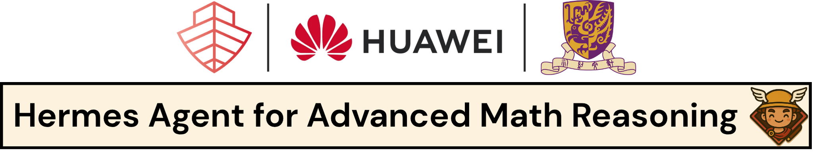

# HERMES Agent

Official implementation of HERMES agent for Lean4-powered mathematical reasoning from [HERMES: Towards Efficient and Verifiable Mathematical Reasoning in LLMs]().

Azim Ospanov 1, Farzan Farnia 2, Jiacheng Sun 1, Haoli Bai 1, Xin Shen 3, Zijin Feng 2

1 **Noah's Ark Lab**

2 **Department of Computer Science and Engineering, The Chinese University of Hong Kong**

3 **Celia Team**

