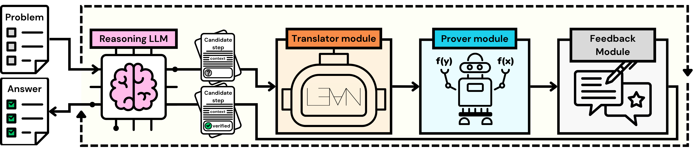

# HERMES Agent


Azim Ospanov <sup>1,</sup><sup>2</sup>, Zijin Feng <sup>1</sup>, Jiacheng Sun <sup>1</sup>, Haoli Bai <sup>1</sup>, Xin Shen <sup>3</sup>, Farzan Farnia <sup>2</sup>


<sup>1</sup> <sub>**Noah's Ark Lab**, </sub> <sup>2</sup> <sub>**The Chinese University of Hong Kong**, </sub> <sup>3</sup> <sub>**Celia Team**</sub>

## Overview 
This repository accompanies ["HERMES: Towards Efficient and Verifiable Mathematical Reasoning in LLMs"]() work published on Arxiv. The codebase contains the agent implemented with LangChain and additional documentation on how to set it up with Lean4. The high-level overview of the method is below:




## Evaluation Results

<table>
  <tr>
    <th></th>
    <th colspan="4">Qwen3-8B</th>
    <th colspan="4">OpenAI o3-mini</th>
    <th colspan="4">DeepSeek-V3.1</th>
  </tr>
  <tr>
    <td></td>
    <td>MATH</td>
    <td>AIME</td>
    <td>CM</td>
    <td>HM2</td>
    <td>MATH</td>
    <td>AIME</td>
    <td>CM</td>
    <td>HM2</td>
    <td>MATH</td>
    <td>AIME</td>
    <td>CM</td>
    <td>HM2</td>
  </tr>
  <tr>
    <td>ZS-CoT@1</td>
    <td>84.8</td><td>20.0</td><td>69.1</td><td>4.3</td><td>95.8</td><td>63.3</td><td>75.2</td><td>23.2</td><td>94.8</td><td>46.7</td><td>78.0</td><td>22.7</td>
  </tr>
  <tr>
    <td> Majority@5 </td>
    <td> 87.0 </td><td> 16.7 </td><td> 70.3 </td><td> 4.7 </td><td> 96.8 </td><td> 70.0 </td><td> 76.0 </td><td> 22.7 </td><td> 96.6 </td><td> 40.0 </td><td> 78.5 </td><td> 25.6 </td>
  </tr>
  <tr>
    <td> Skywork </td>
    <td>91.0 </td><td> <b>30.0</b> </td><td> 72.0 </td><td> 5.7 </td><td> 96.8 </td><td> 83.3 </td><td> 76.1 </td><td> 29.4 </td><td> 96.6 </td><td> 53.3 </td><td> 80.2 </td><td> 28.4 </td>
  </tr>
  <tr>
    <td> ArmoRM </td>
    <td>88.6 </td><td> <b>30.0</b> </td><td> 72.4 </td><td> 5.2 </td><td> 96.2 </td><td> 76.7 </td><td> 76.1 </td><td> 28.4 </td><td> 95.6 </td><td> 56.7 </td><td> 80.5 </td><td> 26.5</td>
  </tr>
  <tr>
    <td> Shepherd </td>
    <td>87.8 </td><td> 23.3 </td><td> 70.2 </td><td> 5.7 </td><td> 96.4 </td><td> 80.0 </td><td> 75.7 </td><td> 25.6 </td><td> 96.2 </td><td> 46.7 </td><td> 79.0 </td><td> 28.0</td>
  </tr>
  <tr>
    <td> RLHFLow </td>
    <td>84.0 </td><td> 20.0 </td><td> 69.4 </td><td> 5.7 </td><td> 95.8 </td><td> 70.0 </td><td> 75.9 </td><td> 28.4 </td><td> 95.4 </td><td> 50.0 </td><td> 78.7 </td><td> 25.6</td>
  </tr>
  <tr>
    <th colspan="13" align="left"><i>Lean-Based Methods</i></th>
  </tr>
  <tr>
    <td> Safe </td>
    <td>89.4 </td><td> 23.3 </td><td> 72.4 </td><td> 5.7 </td><td> 96.0 </td><td> 83.3 </td><td> 75.7 </td><td> 26.1 </td><td> 96.2 </td><td> 46.7 </td><td> 80.9 </td><td> 27.5</td>
  </tr>
  <tr>
    <td> Safe* </td>
    <td>89.4 </td><td> 23.3 </td><td> 72.5 </td><td> 6.2 </td><td> 96.8 </td><td> 83.3 </td><td> 75.8 </td><td> 25.6 </td><td> 96.6 </td><td> 53.3 </td><td> 81.0 </td><td> 27.5</td>
  </tr>
  <tr>
    <td> <i> <b>HERMES</b> </i> </td>
    <td><b>91.2</b> </td><td> <b>30.0</b> </td><td> <b>73.0</b> </td><td> <b>6.6</b> </td><td> <b>97.2</b> </td><td> <b>86.7</b> </td><td> <b>78.9</b> </td><td> <b>31.3</b> </td><td> <b>97.4</b> </td><td> <b>66.7</b> </td><td> <b>83.3</b> </td><td> <b>30.3</b> </td>
  </tr>
</table>

## Implementation Details
Implementation and documentation will be released soon. Stay tuned!

## Bibtex Citation
```bibtex
@misc{
  ...
}
```


